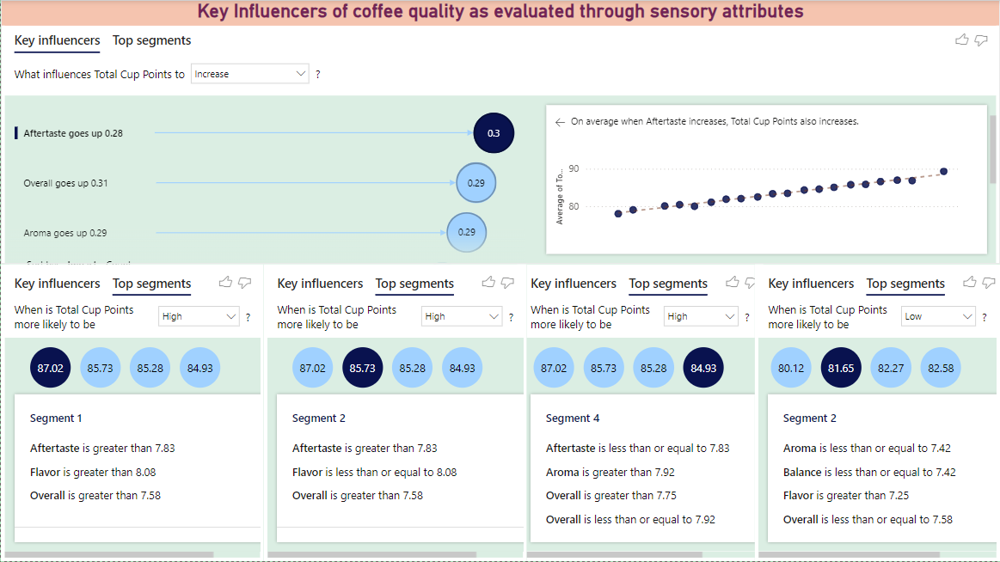
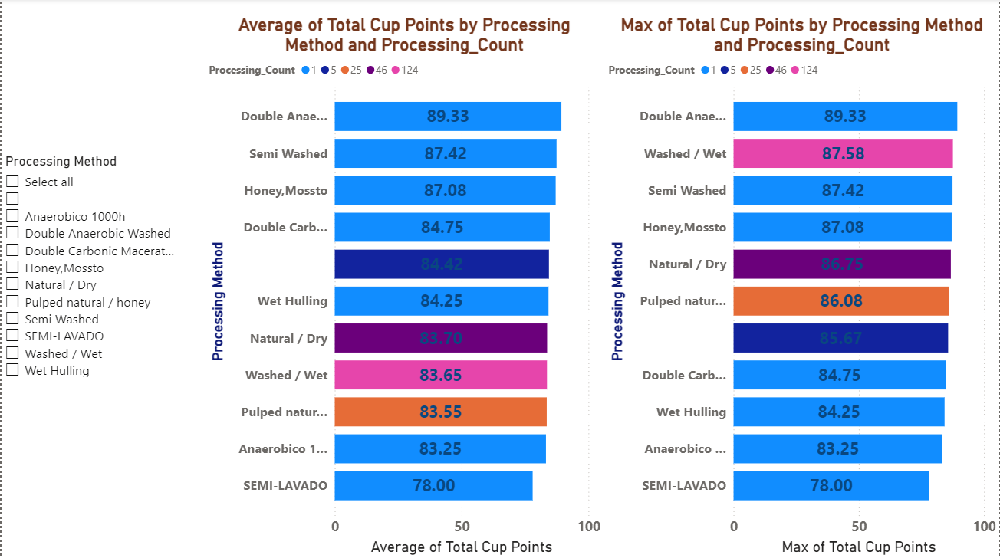
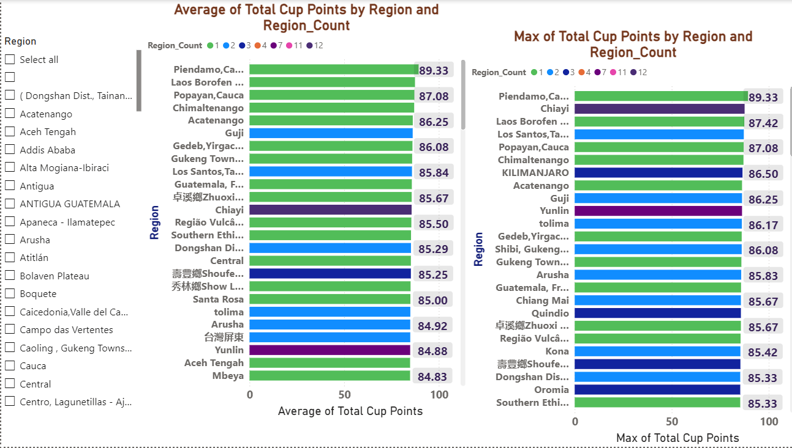
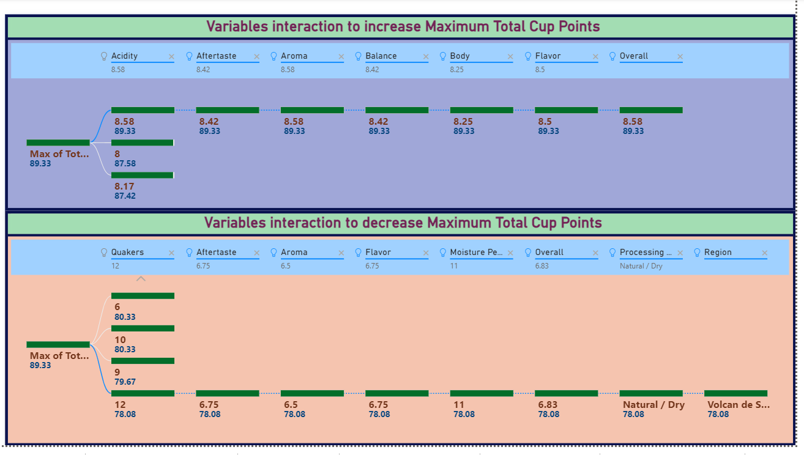

# ☕ Coffee Quality Analysis using Power BI

## Overview
This project analyzes coffee quality data provided by the **Coffee Quality Institute (CQI)** to understand
the factors that influence overall coffee quality, measured by **Total Cup Points**.
The analysis is performed using **Power BI**, with a focus on visual exploration, correlation analysis,
and multi-variable interaction insights.

---

## About the Dataset
The Coffee Quality Institute (CQI) is a non-profit organization dedicated to improving coffee quality
and value worldwide. The dataset contains detailed information related to:

- Sensory evaluations (Aroma, Flavor, Aftertaste, Acidity, Body, Balance, etc.)
- Processing methods
- Origin regions and altitude
- Defects (Category One and Category Two)
- Physical properties such as moisture content

**Total Cup Points** represents the overall coffee quality score and is the sum of multiple sensory attributes.

---

## Objective
The primary goal of this project is to explore and answer the following questions:

1. What are the key sensory attributes that determine coffee quality?
2. How do processing methods and origin regions impact Total Cup Points?
3. What role do defects play in reducing coffee quality?
4. How do multiple variables interact together to influence overall coffee quality?

---

## Tool Used
- **Power BI Desktop**
  - Data modeling 
  - DAX measures for calculated metrics
  - Interactive dashboards and visual analytics
  - Decomposition Tree analysis for multi-variable interaction insights
  - Key Influencers visual to identify primary drivers of Total Cup Points
  - Scatter plots to identify trends in defect occurrences and their impact on overall coffee quality
  - Bar charts to find impact of processing methods, origin regions on coffee quality scores

---

## Key Insights
- Sensory attributes such as **Aroma, Flavor, and Aftertaste** are the strongest contributors to high coffee quality.
- Coffees with **zero defects (quakers)** consistently achieve higher Total Cup Points.
- An optimal moisture range of **10.4%–11.8%** is associated with peak quality scores.
- Coffees grown at **high altitudes (≥1700 meters)** tend to exhibit superior quality.
- Advanced processing methods such as **Double Anaerobic Washed** outperform traditional methods in terms of quality.

---

## Visual Analysis
Below are key Power BI visuals used to explore and explain coffee quality drivers.

### Overview Dashboard

### Key Influencers Analysis

### Processing Methods vs Quality

### Regional and Altitude Analysis

### Defects Impact – Scatter Plot Analysis

### Decomposition Tree – Variable Interaction

---

## Business Impact
The insights from this analysis can help:
- Coffee producers focus on controllable quality factors
- Buyers and graders identify high-quality sourcing regions
- Improve processing and quality control strategies in specialty coffee markets

---

## Repository Contents
- `powerbi/` → Power BI dashboard file (.pbix)
- `screenshots/` → Dashboard screenshots
- `docs/` → Detailed project report
- `data/` → Coffee quality dataset

---

## Author
**Vishnu Vardhan Reddy Kukudala**  
Aspiring Data Scientist | Power BI | Data Analysis
